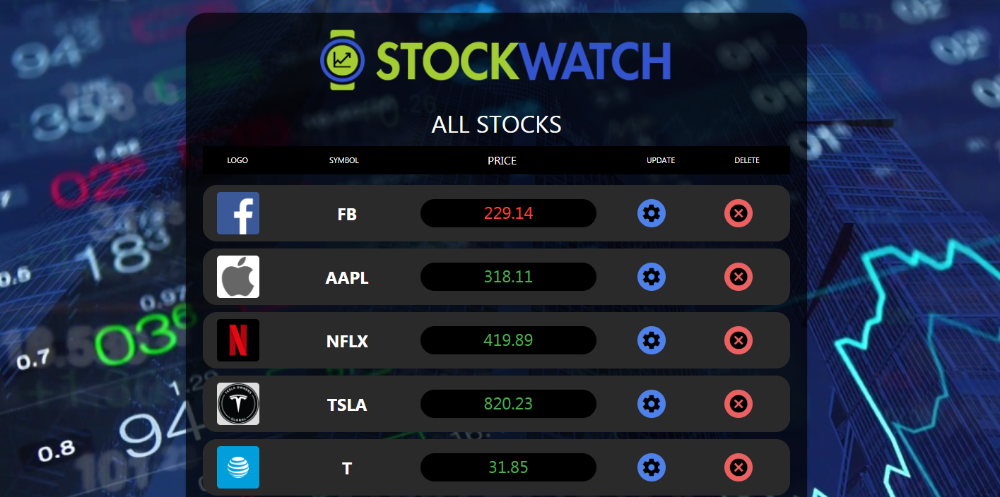

# STOCKWATCH

## Description 

Tracking stocks is a tedious task and many stock apps have an overly complicated UI.  When it comes to trading stocks, we only care about 2 things: when to buy and when to sell.

Our app allows users to track an unlimited amount of stocks and filter their tracked stocks based on buy and sell price limits. This allows our user to quickly make purchase/sell decisions on multiple stocks rather than tracking each one individually.

Our goal: make tracking, buying and selling multiple stocks simple.

## User Story

As a novice or professional stock trader, I want to track multiple stock prices without having to check each stock individually. 
With so many stocks to track, StockWatch can be used to filter the stocks based on a buy and sell opportunities.

## Table of Contents (Optional)

If your README is very long, add a table of contents to make it easy for users to find what they need.

* [Installation](#installation)
* [Usage](#usage)
* [Credits](#credits)
* [License](#license)

## Installation

Visit https://thawing-sea-68388.herokuapp.com/

## Usage 

* see demo *

## Credits

- Marc Strong
- Jee Zhou
- Sam Kim
- Bikram Biswa

## License

FMP API - https://financialmodelingprep.com/

---
© 2020 STOCKWATCH. All Rights Reserved.
